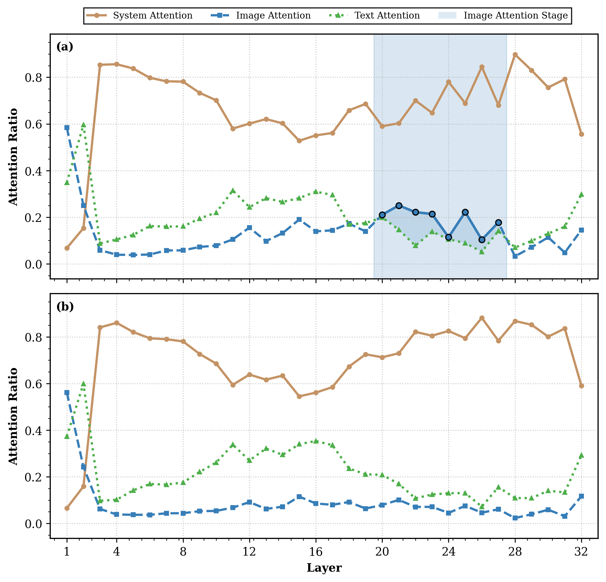
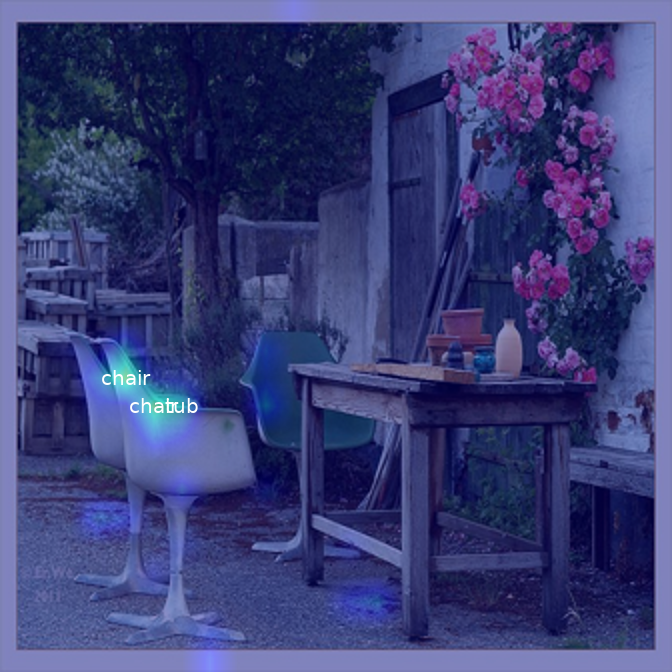
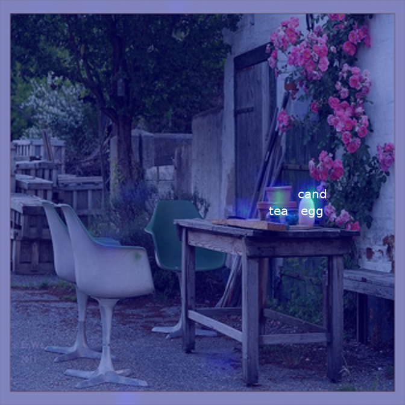
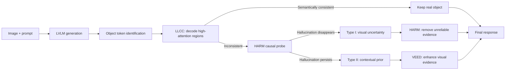

<div align="center">

# Same Attention, Different Truths

### Put Logit-Lens over Visual Attention to Detect and Mitigate LVLM Object Hallucination

**Zichuan Wang · Songlin Yang · Bo Peng · Zhenchen Tang · Yang Li · Beibei Dong · Jing Dong**

**CVPR 2026 Highlight**

<p>
  <a href="https://openaccess.thecvf.com/content/CVPR2026/html/Wang_Same_Attention_Different_Truths_Put_Logit-Lens_over_Visual_Attention_to_CVPR_2026_paper.html"></a>
  <a href="https://github.com/wzczc/SADT"></a>
  <a href="LICENSE"></a>
</p>

> **Object hallucination is not simply a failure to look.** Real and hallucinated objects can receive equally strong visual attention; what separates them is whether the attended visual evidence semantically supports the generated token.

</div>

## The Finding

LVLMs exhibit a distinct **Image-Attention Stage** in their mid-to-late layers. During this stage, both real and hallucinated object tokens attend strongly to localized image regions. Attention magnitude alone therefore cannot reliably explain hallucination.

<p align="center">
  
</p>

SADT places a **Logit Lens** over those high-attention visual regions. The difference becomes visible: regions supporting a real object decode to semantically consistent tokens, while regions associated with a hallucinated object do not.

<table>
  <tr>
    <td align="center"></td>
    <td align="center"></td>
  </tr>
  <tr>
    <td align="center"><b>Real object: chair</b><br>Attended regions decode to chair-related tokens.</td>
    <td align="center"><b>Hallucinated object: bowl</b><br>Attended regions decode to unrelated tokens.</td>
  </tr>
</table>

This semantic view further reveals two causes of hallucination:

| Mechanism | What happens | Causal probe | Targeted remedy |
|---|---|---|---|
| **Visual uncertainty** | The model anchors to an ambiguous or confusable region. | The hallucination disappears after masking that region. | **HARM** removes the unreliable visual evidence. |
| **Contextual prior** | A strong co-occurrence prior overrides valid visual evidence. | The hallucination persists and attention shifts after masking. | **VEED** injects genuine visual semantics into decoding. |

## Detect, Classify, Mitigate

SADT is a **training-free**, cause-aware inference framework. It detects hallucinated object tokens, identifies their underlying mechanism, and applies a different intervention to each type.



<!-- Replace the Mermaid block with assets/sadt_framework.png if the standalone paper Figure 6 is added later. -->

- **LLCC — Logit-Lens Consistency Check:** detects whether high-attention visual features support the generated object token.
- **HARM — High-Attention Regions Masking:** serves as both a causal classifier and the mitigation for visual-uncertainty hallucinations.
- **VEED — Visual Evidence Enhanced Decoding:** promotes image-grounded visual logits when contextual priors dominate generation.

## Main Results

### Hallucination detection

LLCC directly checks whether the generation is grounded in the semantics of its attended visual source.

| Method | Precision | Recall | F1 |
|---|---:|---:|---:|
| Uncertainty Score | 0.5965 | 0.6415 | 0.6182 |
| InterConf | 0.6717 | 0.6907 | 0.6811 |
| SVAR | 0.6500 | 0.7222 | 0.6842 |
| **LLCC (ours)** | **0.7870** | **0.7955** | **0.7932** |

### Hallucination mitigation on CHAIR

Lower is better for both CHAIRS and CHAIRI.

| Backbone | Greedy CHAIRS / CHAIRI | SADT CHAIRS / CHAIRI |
|---|---:|---:|
| LLaVA-1.5-7B | 49.8 / 20.4 | **26.8 / 10.0** |
| LLaVA-1.5-13B | 47.8 / 19.8 | **31.3 / 12.4** |
| Shikra-7B | 58.4 / 22.2 | **31.4 / 12.7** |
| Qwen2-VL-7B | 31.4 / 12.7 | **24.0 / 8.3** |

### Hallucination mitigation on AMBER

SADT lowers hallucination while preserving object coverage.

| Backbone | Greedy CHAIR / Cover / Hal | SADT CHAIR / Cover / Hal |
|---|---:|---:|
| LLaVA-1.5-7B | 6.9 / 51.0 / 32.0 | **2.8 / 51.2 / 14.7** |
| LLaVA-1.5-13B | 6.8 / 52.0 / 31.7 | **4.0 / 52.0 / 24.1** |
| Shikra-7B | 10.6 / 52.0 / 47.0 | **5.3 / 52.3 / 30.3** |

## Quick Start

### 1. Installation

```bash
git clone https://github.com/wzczc/SADT.git
cd SADT

conda create -n sadt python=3.10 -y
conda activate sadt
pip install -e .
```

Download a local LLaVA-1.5 checkpoint, such as `liuhaotian/llava-v1.5-7b`, and pass its directory through `--model-path`. WordNet-based matchers additionally require:

```bash
python -m nltk.downloader wordnet omw-1.4
```

### 2. Run the complete pipeline

The public entry point performs **detection + mechanism classification + targeted mitigation** in one process:

```bash
CUDA_VISIBLE_DEVICES=0 python tools/sadt/detect_classify_mitigate.py \
  --model-path /path/to/llava-v1.5-7b \
  --image-dir data/test_imgs \
  --labels-json data/metadata/hallucination_results_val500.json \
  --chair-cache data/chair.pkl \
  --semantic-matcher coco \
  --output-json outputs/sadt_full_pipeline/results.json
```

For a one-image smoke test:

```bash
CUDA_VISIBLE_DEVICES=0 python tools/sadt/detect_classify_mitigate.py \
  --model-path /path/to/llava-v1.5-7b \
  --image-file data/test_imgs/COCO_val2014_000000007795.jpg \
  --labels-json data/metadata/hallucination_results_val500.json \
  --chair-cache data/chair.pkl \
  --output-json outputs/sadt_smoke_test/results.json
```

The output JSON contains the original response, generated and ground-truth objects, labeled and detected hallucinations, Type-I/Type-II assignments, and aggregate detection/CHAIR metrics. HARM images remain in memory and are not written to disk.

## Semantic Matching

LLCC compares each generated object with the tokens decoded from its attended visual regions. Select a backend with `--semantic-matcher`:

| Matcher | Semantic expansion |
|---|---|
| `coco` | CHAIR/COCO synonym groups; the default and recommended setting for CHAIR evaluation. |
| `predefined` | Small manually defined similarity groups in `tools/sadt/core.py`. |
| `wordnet` | Lemmas from the target noun's WordNet synsets. |
| `wordnet-similarity` | Noun synsets above `--wordnet-similarity-threshold` (default: `0.9`). |
| `coco-wordnet` | Union of COCO synonyms and WordNet synset lemmas. |
| `llm-judge` | Direct YES/NO semantic judgment through an OpenAI-compatible endpoint. |

<details>
<summary><b>Use an LLM judge</b></summary>

```bash
export SADT_LLM_JUDGE_API_BASE=http://127.0.0.1:8000/v1/chat/completions
export SADT_LLM_JUDGE_MODEL=your-local-judge-model

CUDA_VISIBLE_DEVICES=0 python tools/sadt/detect_classify_mitigate.py \
  --model-path /path/to/llava-v1.5-7b \
  --image-file data/test_imgs/COCO_val2014_000000007795.jpg \
  --semantic-matcher llm-judge \
  --llm-judge-api-base "$SADT_LLM_JUDGE_API_BASE" \
  --llm-judge-model "$SADT_LLM_JUDGE_MODEL" \
  --output-json outputs/sadt_llm_judge/results.json
```

For a hosted endpoint, set the API key environment variable named by `--llm-judge-api-key-env` (`OPENAI_API_KEY` by default).

</details>

## Reproduce the Mechanism Analysis

### Dataset-level attention statistics

Collect the statistics used by Figures 1 and 2:

```bash
CUDA_VISIBLE_DEVICES=0 python tools/visualization/paper_figures.py save-vis-data \
  --model-path /path/to/llava-v1.5-7b \
  --image-dir data/test_imgs \
  --labels-json data/metadata/hallucination_results_val500.json \
  --chair-cache data/chair.pkl \
  --output-dir outputs/llava7b_attention \
  --output-name vis_data_7b
```

Render the aggregate figures:

```bash
python tools/visualization/paper_figures.py fig1 \
  --stats-pkl outputs/llava7b_attention/vis_data_7b.pkl \
  --output outputs/paper_figures/fig1.png

python tools/visualization/paper_figures.py fig2 \
  --stats-pkl outputs/llava7b_attention/vis_data_7b.pkl \
  --output outputs/paper_figures/fig2.png
```

### Single-image Logit-Lens visualization

Cache the model trace, then visualize the high-attention patches and their decoded tokens:

```bash
CUDA_VISIBLE_DEVICES=0 python tools/visualization/paper_figures.py save-pkl \
  --model-path /path/to/llava-v1.5-7b \
  --image-file data/test_imgs/COCO_val2014_000000007795.jpg \
  --output-dir outputs/attention_cache

CUDA_VISIBLE_DEVICES=0 python tools/visualization/paper_figures.py fig4 \
  --model-path /path/to/llava-v1.5-7b \
  --cache-pkl outputs/attention_cache/COCO_val2014_000000007795.pkl \
  --words chair remote \
  --example-layer 23 \
  --output-dir outputs/paper_figures
```

Use `--all-layers` instead of `--example-layer 23` to render every layer in `--target-layers`. Paper figures are saved as PNG files.

## Repository Layout

```text
SADT/
├── assets/                         # README visualizations
├── data/                           # CHAIR cache, metadata, and demo images
├── evaluation/chair.py             # CHAIR evaluator
├── llava/                          # minimal LLaVA inference runtime
├── tools/sadt/
│   ├── core.py                     # Image-Attention, LLCC, HARM, and VEED
│   ├── detect_classify_mitigate.py # integrated public pipeline
│   ├── pipeline_utils.py           # data, CHAIR, and CLI utilities
│   └── vcd_sample.py               # VEED/VCD-style generation patch
└── tools/visualization/
    ├── paper_figures.py            # paper-figure entry point
    └── visualize_attention.py      # attention collection utilities
```

This release focuses on the paper-facing mechanism analysis and the integrated LLaVA/CHAIR pipeline. Training code, AMBER/debug entry points, and split experimental scripts are intentionally excluded.

## Citation

If this work is useful in your research, please cite:

```bibtex
@InProceedings{Wang_2026_CVPR,
    author    = {Wang, Zichuan and Yang, Songlin and Peng, Bo and Tang, Zhenchen and Li, Yang and Dong, Beibei and Dong, Jing},
    title     = {Same Attention, Different Truths: Put Logit-Lens over Visual Attention to Detect and Mitigate LVLM Object Hallucination},
    booktitle = {Proceedings of the IEEE/CVF Conference on Computer Vision and Pattern Recognition (CVPR)},
    month     = {June},
    year      = {2026},
    pages     = {25315--25325}
}
```

## Acknowledgments

This repository builds on [LLaVA](https://github.com/haotian-liu/LLaVA), [VCD](https://github.com/DAMO-NLP-SG/VCD), and the [CHAIR](https://github.com/LisaAnne/Hallucination) evaluation protocol. We thank their authors for making their work publicly available.

## License

Released under the [Apache License 2.0](LICENSE).
